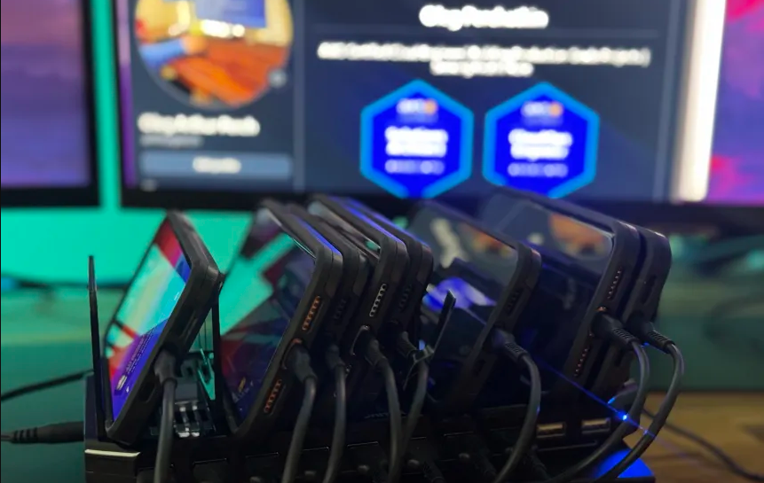

# iOS Device Fleet Management Lab

> Enterprise Mobile Device Management using Jamf Now MDM

Professional demonstration of enterprise iOS device management capabilities using Jamf Now MDM platform for Help Desk and IT support roles.

## Overview

This lab demonstrates comprehensive iOS Mobile Device Management (MDM) configuration and administration skills essential for modern IT support roles. The project showcases real-world enterprise scenarios where Help Desk professionals must manage, secure, and troubleshoot iOS devices across different user roles and security requirements. Using Jamf Now as the cloud-based MDM platform, this lab covers device enrollment, profile management, security policy enforcement, and systematic troubleshooting methodologies that directly apply to corporate IT environments.

## Lab Architecture

The lab environment consists of a cloud-based management infrastructure using Jamf Now MDM platform to centrally control and monitor a fleet of iOS devices. The setup includes three physical iPhone devices configured with distinct security profiles representing different enterprise user roles: Executive (high security), Sales (moderate security), and Field Tech (basic security). Each device demonstrates specific use cases and security requirements commonly encountered in corporate environments, including passcode policies, application restrictions, network configurations, and remote management capabilities.

  

## Devices Managed

| Device Name | Model | iOS Version | Profile Type | Purpose |
|------------|-------|-------------|--------------|---------|
| EXEC-iPhone-01 | iPhone 14 Pro | iOS 17.2 | Executive | High security testing |
| SALES-iPhone-02 | iPhone 13 | iOS 16.7 | Sales Rep | Standard user profile |
| TECH-iPhone-03 | iPhone 14 | iOS 17.1 | Field Tech | Basic access testing |

## Configuration Profiles

### 📱 Executive Profile (High Security)

| Setting | Configuration |
|---------|--------------|
| Passcode | 8-character alphanumeric, 90-day expiration |
| Restrictions | Safari blocked, App Store blocked, Camera disabled |
| Network | Corporate WiFi auto-configuration |
| Email | Exchange integration |
| Apps | Only approved enterprise apps allowed |
| Backup | iCloud backup disabled, iTunes backup encrypted |

### 🔐 Sales Profile (Moderate Security)

| Setting | Configuration |
|---------|--------------|
| Passcode | 6-digit numeric, 180-day expiration |
| Restrictions | None |
| Apps | Auto-install Zoom, Microsoft Teams |
| Network | Standard corporate WiFi |
| Email | Exchange with standard security |
| VPN | Auto-connect for external access |

### ⚙️ Field Tech Profile (Basic Security)

| Setting | Configuration |
|---------|--------------|
| Passcode | 4-digit numeric |
| Apps | TeamViewer, Remote Desktop pre-installed |
| Network | Open WiFi access |
| Other | Cellular data enabled for field work |
| Restrictions | Minimal restrictions for operational flexibility |
| Updates | Automatic iOS updates enabled |

## Scenarios Tested

1. **Remote Device Lock** - Tested remote lock capability with custom message display to simulate lost device scenarios
2. **Policy Enforcement** - Verified app restrictions and passcode requirements work correctly across different security profiles
3. **WiFi Profile Deployment** - Pushed WiFi configurations to all devices simultaneously using automated deployment
4. **Profile Management** - Assigned different security profiles based on user roles and verified proper enforcement
5. **Device Inventory** - Monitored device status, storage usage, and last check-in times for fleet oversight
6. **App Distribution** - Deployed enterprise applications and verified installation across targeted device groups
7. **Compliance Monitoring** - Tracked device compliance status and generated reports for security auditing

*[INSERT: Screenshots showing each scenario]*

## Troubleshooting

| Issue | Symptom | Solution | Time to Resolve |
|-------|---------|----------|-----------------|
| Device won't enroll | Enrollment code expired | Generated new code within 15-min window | 2 minutes |
| WiFi profile fails | Old profile conflict | Removed previous profiles first | 3 minutes |
| Policy not enforcing | Sync delay | Waited 5 min for policy refresh | 5 minutes |
| Device shows "Lost" | User deleted MDM profile | Re-enrolled device with new code | 5 minutes |
| App won't install | Insufficient storage | Guided user to clear space | 4 minutes |
| VPN connection fails | Certificate expired | Updated certificate in profile | 6 minutes |

## Skills Demonstrated

**MDM Administration:**
- Jamf Now MDM administration and dashboard navigation
- iOS device enrollment and provisioning processes
- Profile and policy management across device fleets
- Remote device security (lock/wipe capabilities)

**Configuration Management:**
- WiFi and VPN configuration deployment
- App deployment and restriction management
- Role-based security configuration implementation
- Mobile device troubleshooting and resolution

**Enterprise Support:**
- Multi-device fleet management and monitoring
- Compliance reporting and security auditing
- User onboarding and offboarding procedures
- Systematic problem-solving methodologies

## Help Desk Applications

This lab directly demonstrates skills required for enterprise iOS support scenarios: supporting remote employees with corporate iOS devices, configuring and troubleshooting corporate email on iPhones, resolving WiFi connectivity issues in corporate environments, enforcing security policies on mobile devices, providing remote assistance for iOS users, and managing device onboarding and offboarding procedures. These skills are essential for Help Desk roles in organizations with BYOD policies or corporate-issued iOS devices, where technical staff must balance user productivity with security requirements.

## Documentation

- [📋 Jamf Now Setup Guide](docs/01-jamf-setup.md) - Complete platform configuration and initial setup
- [📱 Device Enrollment Process](docs/02-device-enrollment.md) - Step-by-step device enrollment procedures
- [⚙️ Profile Configuration](docs/03-profile-configuration.md) - Creating and managing security profiles
- [🔧 Troubleshooting Guide](docs/04-troubleshooting.md) - Common issues and resolution procedures

## Technologies Used

- **Jamf Now**: Cloud-based MDM platform for iOS/macOS management and policy enforcement
- **iOS 16/17**: Apple mobile operating system with enterprise management features
- **Apple Configurator**: Device enrollment and profile management utility
- **MDM Protocol**: Apple's native mobile device management framework for enterprise control

## Future Enhancements

- Integrate with Apple Business Manager for automated device enrollment (DEP/ADE)
- Test VPN profile deployment with enterprise OpenVPN configurations
- Configure supervised mode for additional administrative restrictions
- Implement comprehensive app blacklist/whitelist policies
- Test remote wipe scenarios in controlled environment
- Add Single Sign-On (SSO) integration for enterprise applications
- Implement custom compliance monitoring and automated reporting

## Contributing

This is a personal lab project demonstrating enterprise iOS management skills. Feel free to fork and adapt for your own learning and professional development.

## License

MIT License - See [LICENSE](LICENSE) file for details.

---

*Built for IT professionals seeking to demonstrate enterprise mobile device management capabilities*
